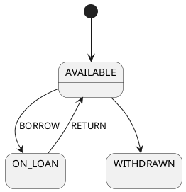
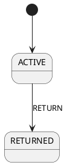

# Library: toy project for the ontology format

The only source of the toy library project. Each `## <anchor> <title>` heading opens a section that runs to the next `## ` heading; the anchor is the first word of the heading.

## L1 Book

A Book is one physical copy in the catalog.

```text
Book
- id
- branch_id
- title
- state
```

The title of a Book is set when the copy is catalogued.
The state of a Book is AVAILABLE, ON_LOAN or WITHDRAWN.

## L2 Member

A Member is a person who may borrow books.

```text
Member
- id
- branch_id
- person_id?
- blocked_until?
- open_loans
```

A librarian sets blocked_until when a member may not borrow until that time.
A Member is one Person at one Branch; person_id names the Person.
open_loans counts the ACTIVE loans of the member and is updated in the same transaction as the loan.

## L3 Loan

A Loan records that a Member borrowed a Book. The Loan refers to the Book by book_id and to the Member by member_id.

```text
Loan
- id
- branch_id
- book_id
- member_id
- state
- due_date
- return_condition?
```

The state of a Loan is ACTIVE or RETURNED.
due_date is set by BORROW.
A Loan is overdue when it is ACTIVE and its due_date has passed.
RETURN records the return_condition of the Loan: GOOD or DAMAGED.

## L4 Book State



A librarian withdraws a copy outside the system.

## L5 Loan State



## L6 Actions

| Object | Transition | Trigger |
|---|---|---|
| Book | AVAILABLE → ON_LOAN | BORROW |
| Book | ON_LOAN → AVAILABLE | RETURN |
| Loan | ACTIVE → RETURNED | RETURN |

BORROW creates a Loan for an AVAILABLE Book and a Member who is not blocked.
RETURN closes an ACTIVE Loan and makes the Book AVAILABLE again.
BORROW and RETURN write Book and Member in the same transaction as the Loan.
BORROW takes member_id, the Member who borrows; only that Member may submit BORROW.
BORROW takes book_id, the Book to lend.
RETURN takes loan_id, the Loan to close.
BORROW and RETURN check their rules from top to bottom; the first rule that matches decides.
BORROW by anyone other than that Member is REJECTED. BORROW of a Book that is not AVAILABLE is REJECTED. BORROW by a blocked Member is REJECTED. BORROW by a Member with a Loan that is not returned in GOOD condition is REFERRED to a librarian. Otherwise BORROW is BORROWED.
RETURN of a Loan that is not ACTIVE is REJECTED. RETURN after the due_date, on the date of the Branch timezone, is RETURNED_LATE. Otherwise RETURN is RETURNED.
The caller of an action is a Person.
<!-- BEGIN GENERATED: action-summary -->
Generated from the ontology: BORROW edits Book.state and Member.open_loans.
<!-- END GENERATED: action-summary -->

## L7 Contexts

- Catalog: Book
- Circulation: Member, Loan, Branch, Person

## L8 Stores

```text
books
members
loans
branches
people
audit_log
```

Every action writes one row to audit_log.

## L9 Events

```text
loan.created
loan.returned
```

## L10 Permissions

```text
loan:create
loan:close
```

| Action | Keys |
|---|---|
| BORROW | `loan:create` |
| RETURN | `loan:close` |

## L11 Scenarios

- S1: a member borrows an AVAILABLE book (BORROW).
- S2: a member returns a book (RETURN).

## L12 Branch

```text
Branch
- id
- timezone
```

A Branch is one library. Every Book, Member and Loan belongs to one Branch by branch_id, and is seen only from that Branch. The timezone of a Branch is set by the librarian.

## L13 Person

```text
Person
- id
```

A Person may be a Member of several branches and is seen from every Branch.

## L14 Outcomes

An action outcome is BORROWED, RETURNED or RETURNED_LATE when the change is made, REJECTED when nothing is changed, and REFERRED when a librarian must decide.
